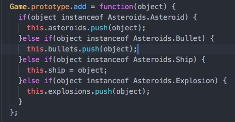
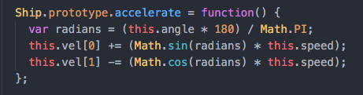

# Asteroids

<!-- [Link to Live Game][asteroids] -->

<!-- [asteroids]: http://www.dwightware.com/Asteroids -->

## About

This is a modern implementation of the classic game, Asteroids. It is written in pure Javascript on an HTML5 canvas element. The game's dimensions and positions are responsive, making it size correctly on any display.

## Code Samples

Polymorphic classes help keep my code DRY and easy to maintain!

Setting constants as instance variables (`this.speed`) makes modifying behavior quick and painless!

## To-Do Items

- [ ] Refactor.
- [ ] Replace hand-tuned constants with responsive ratios.
